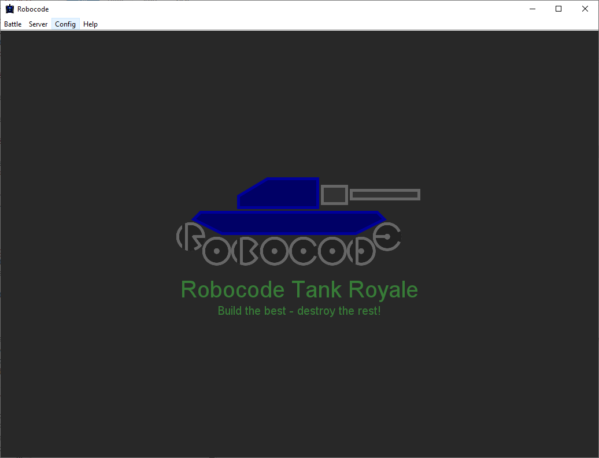
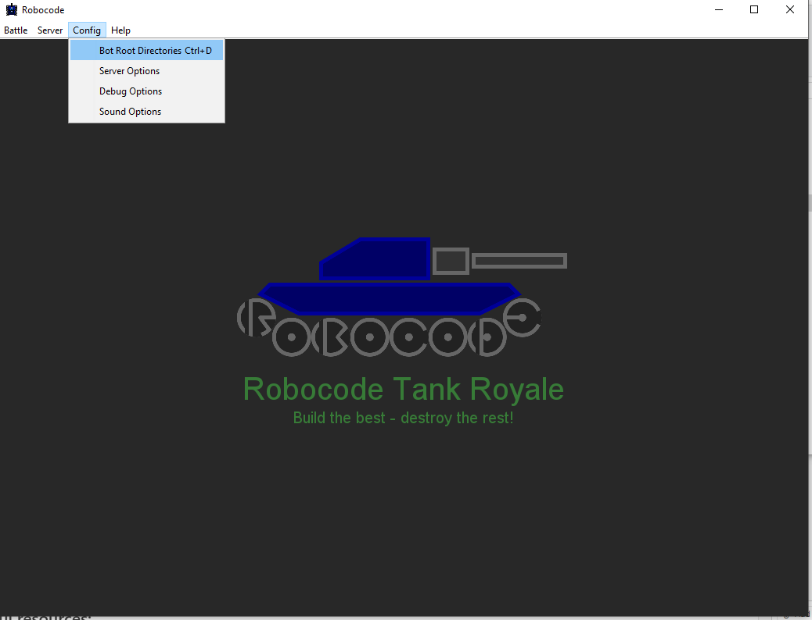
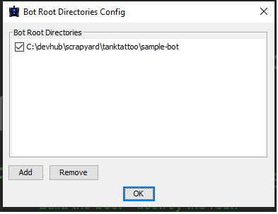

# RTR Bot - Java

Welcome to the Robocode challenge! This repository is for each team to create their Robocode bot in Java.

## Getting Started

To get started, please rename the folder "YourBotName" with the chosen name of your bot and follow the file structure as demonstrated in `MyFirstBot` within `sample-bot` folder.

## File Structure

Your bot's folder should follow this structure:

```
YourBotName/
├── YourBotName.java
├── YourBotName.json
├── YourBotName.sh
├── YourBotName.cmd
└── README.md
```

### Structure of the bot

Within the YourBotName, you should have the following files:

- **YourBotName.java**: This is the main class file for your Robocode bot.
- **YourBotName.sh**: Bash file to run the bot. Just copy the sample file into your directory and correct with your filename.
- **YourBotName.cmd**: Script file to run the bot on Windows.
- **README.md**: A readme file where you might want to tell us about 
your bot.
- **YourBotName.json**: This describes your bot. These fields are required in the json document:
- name
- version
- authors

The remaining fields are all optional, but recommended.

Meaning of each field in the JSON file:

- `name`: is the display name of the bot.
- `version`: is the version of the bot, where SEMVER is the recommended format, but not a requirement.
- `authors`: is a list containing the (full) name of the bot author(s). The name could be a nickname or handle.
- `description`: is a brief description of the bot.
- `homepage`: is a link to a web page for the bot.
- `countryCodes`: is a list containing Alpha-2 country codes, representing the country of each author and/or bot.
platform: is the platform required for running the bot, e.g. Java 17 or .Net 6.0.
- `programmingLang`: is the programming language used for programming the bot, e.g. C# or Kotlin.

## Sample Bot

Refer to the `sample-bot` folder for an example of how to structure your bot's files.

Make sure to test your bot thoroughly before submitting it.

## Start building the bot

To start building the bot, you will need the API jar which you can find under the release section of this repo.

### Supply bot API library
Create a lib folder under root of your bot repository. You need to download the latest robocode-tankroyale-bot-api-x.y.z.jar library from RoboCode Server [https://github.com/sunlove123/Robocode-Server] repository and put this into a folder accessible for your bot. I recommend that you put this into a ../lib folder  in the root directory containing your MyFirstBot directory (../{{YourBotName}}).

In the following, we assume that you created this lib directory beside your bot directory, and copied the bot/sample-bot API jar file into the lib folder

Be ATTENTIVE to your Event Coordinator / Tech Support for any changes done to the API and ensure you have updated the API Jar according during the event.  

### Bot GUI
Time to Test the Bot !!  in your local desktop (outside the code base), 
Donwload latest GUI and Server Robocode-tankroyale-gui-x.y.z.jar and Robocode-tankroyale-server-x.y.z.jar and place in the the RoboCode directory.
Navigate to Execute the GUI jar (cmd line command : java -jar robocode-tankroyale-gui-x.y.z.jar ) 


### Confiugure / Add Bot directory 
Click on Bot Root Directory and add the location of your bot and sample bot directory




Now you are ready to start the battle locally, navigte to Battle directory and start battle. 
#### Alternatively way to launch GUI
You may choose to check out https://github.com/sunlove123/Robocode-Server locally launch the Gui and configure the bot directory to your respective bot repo folders. 

## Useful resources:

- Bot tutorial: https://robocode-dev.github.io/tank-royale/tutorial/my-first-bot.html
- API Doc: https://robocode-dev.github.io/tank-royale/api/apis.html
- Game Dynamics: https://robocode-dev.github.io/tank-royale/tutorial/beyond-the-basics.html
- Bot Anatomy: https://robocode-dev.github.io/tank-royale/articles/anatomy.html
- Some Physics to help you design strategy: https://robocode-dev.github.io/tank-royale/articles/coordinates-and-angles.html & https://robocode-dev.github.io/tank-royale/articles/physics.html

Happy coding and may the best bot win!
